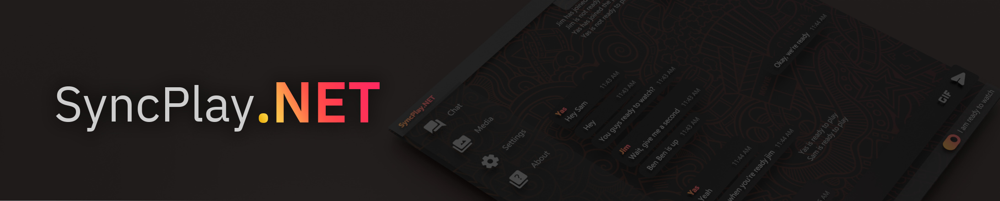
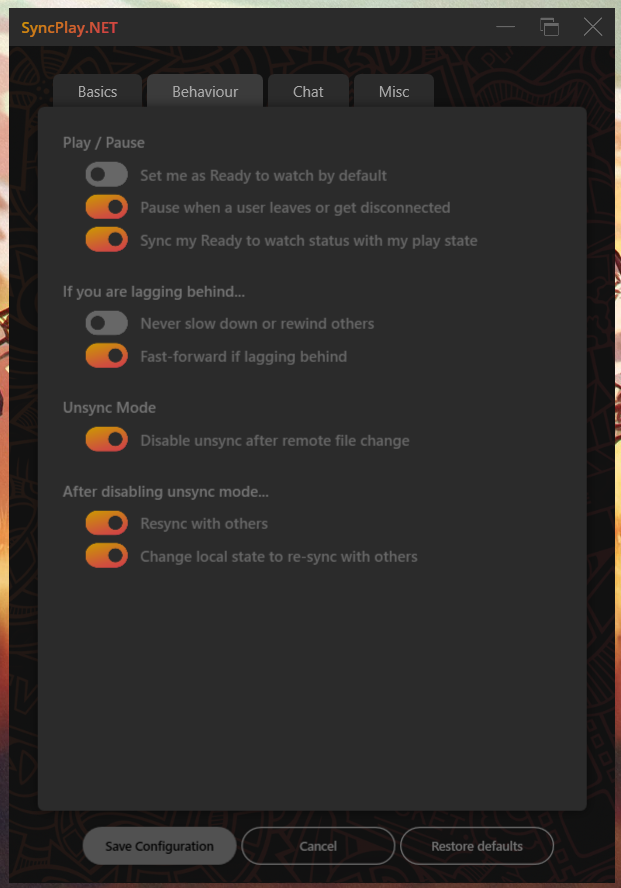

 

SyncPlay.NET is a C# client for the [SyncPlay](https://github.com/Syncplay/syncplay) protocol which allows multiple media players to sync their play state and position so viewers from different devices can watch a media file together. Similar to the original SyncPlay client SyncPlay.NET will also support chat functionality with additional support for other chat clients. As for the compatible players, currently only [VLC media player](https://github.com/videolan/vlc) and [MPV.NET](https://github.com/stax76/mpv.net) is supported.

> **Warning :** Please note that SyncPlay.NET should be used with caution because it cannot be guaranteed to work as well as the original client written by the SyncPlay team. Download the official version of SyncPlay from https://syncplay.pl/download/

## Why does this exist?

The original version of SyncPlay works pretty well. So why did I make this? Well, Jim was being an a**hole about the official SyncPlay client having a nice dark mode on Linux and Windows not having a similar dark mode.

## License 

This project, the Syncplay released binaries, and all the files included in this repository unless stated otherwise in the header of the file,  are licensed under the [Apache License, version 2.0](https://www.apache.org/licenses/LICENSE-2.0.html). A copy of this license is included in the LICENSE file of this  repository.

## Screenshots

	

	

