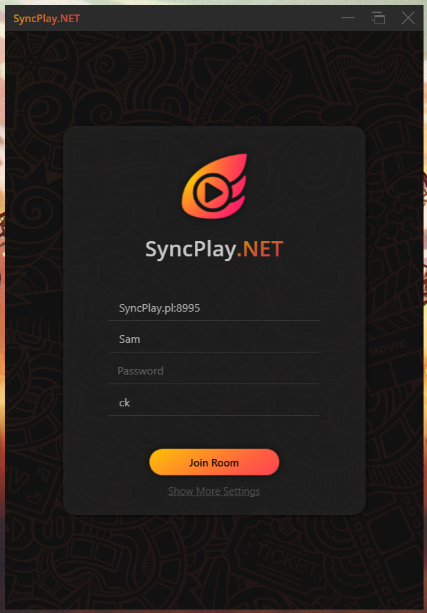

	

SyncPlay.NET is a C# client for the [SyncPlay]() protocol with a user interface made from WPF. As for the compatible players, currently only VLC media player is compatible. As for the interface between SyncPlay.NET and VLC media player, the command line remote control will be used.

## Screenshot

	

	

